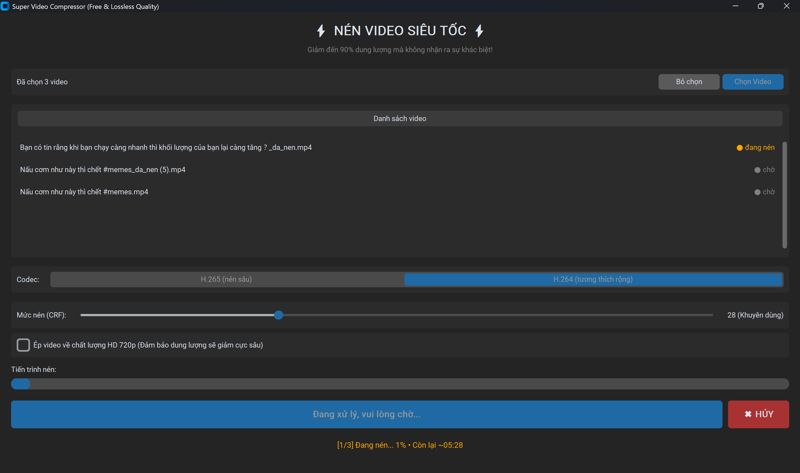
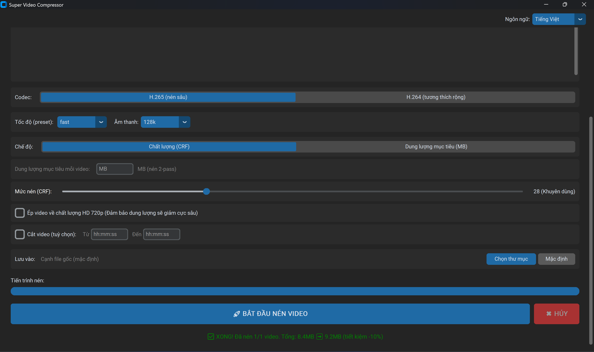

# Super Video Compressor

[](https://github.com/tridpt/VideoCompressor/actions/workflows/tests.yml)
[](LICENSE)
[](https://www.python.org/)

A fast, lightweight, and user-friendly GUI application built with Python and `CustomTkinter`. It utilizes the sheer power of `FFmpeg` to drastically compress your videos, often reducing file sizes by up to 90% without any noticeable loss in visual quality!

## 📸 Screenshots

| Compressing a batch | Finished |
|---|---|
|  |  |

## 🌟 Features

* **Modern GUI:** A sleek Dark Mode interface built using `CustomTkinter`. Simple and responsive.
* **Drag & Drop:** Drop one or more video files straight onto the list, no need to open a dialog. Non-video files are filtered out automatically.
* **Batch Compression:** Select multiple videos at once and the app compresses them one after another, reporting overall progress and a final summary (e.g. "3/3 done"). Files that fail validation are skipped and logged, so one bad file won't stop the whole batch.
* **Per-File Size Report:** Each video in the list shows its original size, then updates to `before ➡️ after (-NN%)` the moment that file finishes, on top of the overall savings summary.
* **Scrollable File List:** Every selected video appears in a scrollable list with a live, color-coded status (waiting / compressing / done / failed / skipped), so you can see exactly where each file is in a batch.
* **Custom Output Folder:** Save compressed files to a folder you choose, or keep the default of saving next to the source. Your choice is remembered.
* **Remembers Your Choices:** Your codec, CRF, 720p option, output folder, and last-used folder are saved to a local `config.json` and restored next time you open the app, no need to reconfigure.
* **Codec Choice:** Pick between **H.265 (`libx265`)** for the deepest compression or **H.264 (`libx264`)** for the widest device/player compatibility.
* **Lossless-like Quality:** Uses highly efficient modern codecs to minimize file size while preserving stunning visual details.
* **Customizable Compression:** Includes an interactive slider to dial in the perfect CRF (Constant Rate Factor) value, giving you total control over the balance between compression strength and output quality (Defaults to a recommended 28).
* **Cancel Anytime:** A dedicated cancel button stops the running encode immediately and cleans up the unfinished output file.
* **Input Validation:** Before encoding, each file is checked with `ffprobe` to confirm it exists, isn't empty, and actually contains a video stream, surfacing a clear error instead of a cryptic FFmpeg failure.
* **Extreme Compression Mode:** Check the "Force 720p HD" option to rapidly scale down huge 4K or 1080p videos to 720p, achieving unparalleled file size reduction while maintaining the exact aspect ratio.
* **Smart Audio Handling:** Compresses embedded audio utilizing the `AAC` codec to ensure maximum space-saving efficiency.
* **Real-Time Progress & ETA:** A live progress bar shows the exact completion percentage while encoding, alongside an estimated time remaining. Progress is calculated by reading FFmpeg's `-progress` output against the video's total duration (via `ffprobe`). For batches, the bar reflects overall progress across all files.
* **Overwrite-Safe Output:** Never silently clobbers existing files. If `video_da_nen.mp4` already exists, the app automatically saves to `video_da_nen (1).mp4`, `(2)`, and so on.
* **Full Error Logging:** When FFmpeg fails, the complete error output is written to `video_compressor_error.log` next to your source file, while the UI shows a clean summary. Makes debugging painless.
* **Auto-Portable FFmpeg:** Integrates `static_ffmpeg` to automatically handle downloading and linking the required FFmpeg binaries onto your machine so you don't have to fiddle with System Environment Variables.
* **Fast and Non-Blocking:** Processes the intensive FFmpeg operations in a background thread, preventing the application UI from freezing. It updates you in real-time and opens the output folder immediately upon finish.
* **Cross-Platform Folder Open:** Automatically opens the output folder when done on Windows, macOS, and Linux.

## 🚀 Installation & Requirements

Ensure you have **Python 3.10+** installed. 

1. **Clone the repository:**
   ```bash
   git clone https://github.com/tridpt/VideoCompressor.git
   cd VideoCompressor
   ```

2. **Install dependencies:**
   ```bash
   pip install customtkinter static_ffmpeg tkinterdnd2
   ```

3. **Run the App:**
   ```bash
   python main.py
   ```

## 🎮 How to Use

1. Click **Chọn Video (Select Video)** and browse for one or more `.mp4`, `.mkv`, `.mov`, or `.avi` files, or simply **drag & drop** them onto the list. You can select multiple videos to compress them as a batch.
2. Pick a **codec**: H.265 for the smallest files, or H.264 for the broadest compatibility.
3. Select your compression level using the **CRF slider**. A lower value means larger files & better quality, whereas a higher value means stronger compression & slightly degraded quality. 28 is the sweet spot.
4. *Optional:* Select the 720p downscaler if you're compressing massive videos to send via email or Discord.
5. *Optional:* Click **Chọn thư mục (Choose Folder)** to save the results somewhere specific, or leave it on the default (next to the source files).
6. Hit **BẮT ĐẦU NÉN VIDEO (START)** and watch the progress bar and ETA, plus each file's before/after size as it finishes. You can press **HỦY (Cancel)** at any time to stop. The output folder opens automatically when finished.

## 👨‍💻 Developer Notes

Developed by **Trần Đức Trí**.
Created to solve the hassle of memorizing long FFmpeg command lines for simple video crunching tasks.

For architecture, code internals, and contribution guidelines, see the [technical documentation (DOCS.md)](DOCS.md).
